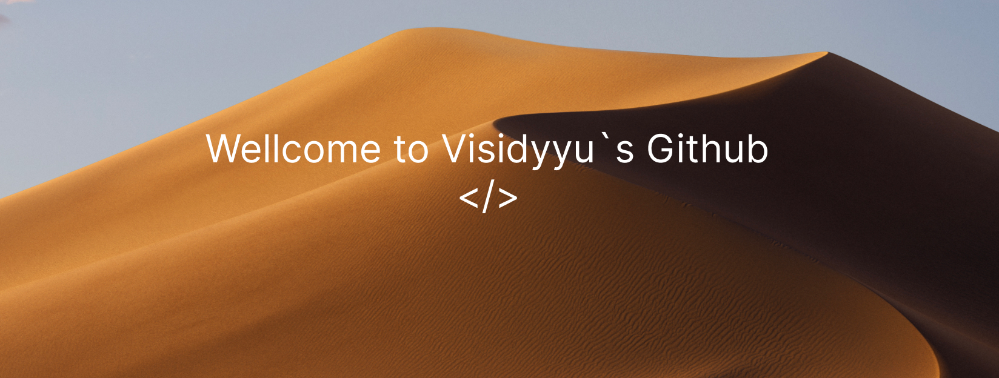

  
  

 

<h2 align="center"> 
   <em>About me </em>
</h2>

 

  Hello There! <em><b>I'm Mihiteru</b></em>, a cross-platform developer. 
  I enjoy building applications for Web, Android and Desktop. 
  Focus on clean architecture, high performance, Material Design 3 / Material You and Fluent Design.

 

    <em><b>Cross-platform developer</b></em>  
    <em><b>Focus on Material Design 3 / Fluent</b></em> 
    <em><b>Clean Architecture & Performance-first</b></em> 
    <em><b>Always learning new tools</b></em> 

 
 

<h2 align="center"> 
   <em> Technologies </em> 
</h2>

  
  
  
  
  
  
  
  
  
  
  
  
  
  
  

 
 

  Made with ❤️ • Updated February 2026

